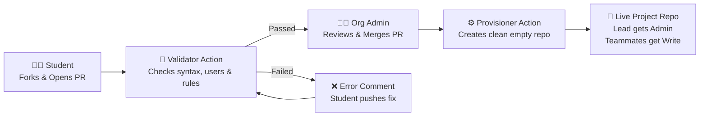

# 🎓 SCSSA-UoK Project Repository Automation

[](https://github.com/SCSSA-UoK/project-requests/actions/workflows/validate.yml)
[](https://github.com/SCSSA-UoK/project-requests/actions/workflows/create-repo.yml)

Automated provisioning system for student course projects in the **Software Engineering & Computer Science Student Association (SCSSA-UoK)**.

---

## 🔄 How the Automation Works



---

## 📝 Student Guide: Requesting a Repository

### Step 1: Fork and Clone
1. Click **Fork** at the top right of this repository.
2. Clone your fork locally or edit directly on GitHub.

### Step 2: Create Your Request File
Under the `requests/` directory, create a single file named after your project:
```text
requests/<repo-name>.yml
```
*(Example: `requests/e22-co2060-Attendance-App.yml`)*

### Step 3: Fill in Project Details
Copy and paste this template into your file:

```yaml
repo: e22-co2060-Attendance-App
description: Real-time QR attendance scanner and backend dashboard.
members:
  - student-github-username-1
  - student-github-username-2
visibility: private   # Use "private" (recommended) or "public"
```

### Step 4: Open a Pull Request
1. Commit and push your changes to a new branch in your fork.
2. Submit a **Pull Request** targeting `main` of `SCSSA-UoK/project-requests`.
3. The **SCSSA Validation Bot** will check your request within 30 seconds.
4. Once an administrator approves and merges your PR, your repository will be created automatically!

---

## 🏷️ Repository Naming Conventions

All repository names must adhere to the official format:

$$\text{eYY}-\text{CATEGORY}-\text{ProjectTitle}$$

| Component | Format | Allowed Values / Examples |
| :--- | :--- | :--- |
| **Batch** | `e[0-9]{2}` | `e20`, `e21`, `e22`, `e23` |
| **Category** | Keyword | `co2060` *(Course Project)*, `3yp` *(3rd Year Project)*, `4yp` *(Final Year Project)* |
| **Title** | Alphanumeric | Words separated by hyphens (e.g., `Smart-Campus`, `Food-Delivery-Api`) |

**Valid Examples:**
- `e22-co2060-Virtual-Lab`
- `e21-3yp-Autonomous-Drone`
- `e20-4yp-Medical-Imaging`

---

## 👥 Roles & Access Permissions

When your new repository is created:

- **Pull Request Author (Team Lead):** Assigned **Admin** rights (can manage settings and branches).
- **Listed Members:** Assigned **Push** rights (can clone, create branches, and push code).
- **Visibility:** Configured per your request (`private` by default for course integrity).

---

## 🛠️ Local Pre-flight Check (Optional)

You can validate your file locally before pushing:
```bash
python3 scripts/validate_request.py --file requests/e22-co2060-My-App.yml
```
