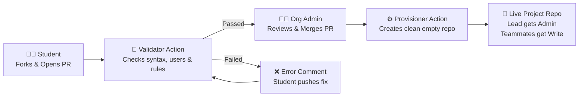

# 🎓 SCSSA-UoK Project Repository Automation

[](https://github.com/SCSSA-UoK/project-requests/actions/workflows/validate.yml)
[](https://github.com/SCSSA-UoK/project-requests/actions/workflows/create-repo.yml)

Automated provisioning system for student course projects in the **Software Engineering & Computer Science Student Association (SCSSA-UoK)**.

---

## 🔄 How the Automation Works



---

## 🚀 Request a Repository (Zero Git Knowledge Required)

Students can request a repository in 30 seconds without creating any files, folders, or pull requests:

<div align="center">
  <br>
  <a href="https://github.com/SCSSA-UoK/project-requests/issues/new?template=request.yml">
    
  </a>
  <br><br>
</div>

1. Click the green button above (or go to **Issues &rarr; New Issue &rarr; "Project Repository Request"**).
2. Fill out the web form with your **Repository Name**, **Category**, and **Teammates**.
3. Click **Submit new issue**.
4. The automated bot will validate your inputs immediately.
5. Once an organization coordinator approves by adding the `approved` label, your repository will be created instantly!

---

## 🔄 Alternative Method: Pull Request Flow (Advanced)
If you prefer creating a YAML file manually via Git:
1. Fork this repository.
2. Add a file `requests/<repo-name>.yml` with your details.
3. Open a Pull Request. Once approved and merged, the repository will be provisioned.

---

## 🏷️ Repository Naming Conventions

All repository names must adhere to the official format:

$$\text{eYY}-\text{CATEGORY}-\text{ProjectTitle}$$

| Component | Format | Allowed Values / Examples |
| :--- | :--- | :--- |
| **Batch** | `e[0-9]{2}` | `e20`, `e21`, `e22`, `e23` |
| **Category** | Keyword | `co2060` *(Course Project)*, `3yp` *(3rd Year Project)*, `4yp` *(Final Year Project)* |
| **Title** | Alphanumeric | Words separated by hyphens (e.g., `Smart-Campus`, `Food-Delivery-Api`) |

**Valid Examples:**
- `e22-co2060-Virtual-Lab`
- `e21-3yp-Autonomous-Drone`
- `e20-4yp-Medical-Imaging`

---

## 👥 Roles & Access Permissions

When your new repository is created:

- **Pull Request Author (Team Lead):** Assigned **Admin** rights (can manage settings and branches).
- **Listed Members:** Assigned **Push** rights (can clone, create branches, and push code).
- **Visibility:** Configured per your request (`private` by default for course integrity).

---

## 🛠️ Local Pre-flight Check (Optional)

You can validate your file locally before pushing:
```bash
python3 scripts/validate_request.py --file requests/e22-co2060-My-App.yml
```
